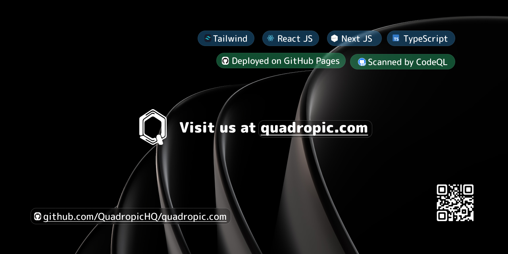

# quadropic.com



## About Quadropic

Quadropic is a dynamic tech startup dedicated to pushing the boundaries of innovation. We specialize in leveraging cutting-edge technologies to deliver top-notch solutions to our clients' toughest challenges.

## Features

- **Next.js Framework**: Quadropic's website is built using Next.js, providing high performance and SEO-friendly web applications.
- **Responsive Design**: Our website is fully responsive, ensuring a seamless experience across all devices.
- **Github Pages Deployment**: We have deployed our website to Github Pages for easy access, with the domain [quadropic.com](https://quadropic.com).

## Setup and Run `quadropic.com` Locally

1. **Clone the Repository**:

   ```
   git clone https://github.com/QuadropicHQ/quadropic.com.git
   ```

2. **Navigate to the Project Directory**:

   ```
   cd quadropic.com
   ```

3. **Install Dependencies**:

   ```
   npm install
   ```

4. **Run the Development Server**:

   ```
   npm run dev
   ```

5. **Access the Website**:
   Open your web browser and visit `http://localhost:3000` to view the Quadropic website locally.

## Contributing

We welcome contributions from the community! If you'd like to contribute to `quadropic.com`, here's how you can do it:

1. Fork the repository on GitHub.
2. Clone your forked repository to your local machine.
3. Create a new branch for your feature/fix:
   ```
   git checkout -b feature-name
   ```
4. Make your changes and commit them with descriptive commit messages:
   ```
   git commit -m "Add feature/fix"
   ```
5. Push your changes to your fork:
   ```
   git push origin feature-name
   ```
6. Open a pull request on the original Quadropic repository and describe your changes.

## Support

If you encounter any issues or have questions, feel free to reach out to our [Open Source Team](mailto:quadropichq+opensource@gmail.com).

## License

This project is licensed under the MIT License. See the [LICENSE](LICENSE) file for details.

---

_© 2024 QuadropicHQ_
